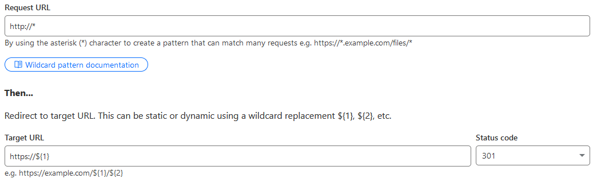

tldr; 

This blog is built using [Hugo](https://gohugo.io) to generate the static content, [Github Pages](https://pages.github.com) for hosting, [Github Actions](https://github.com/features/actions) for continous deployment, and [Cloudflare](https://www.cloudflare.com) for DNS. You can find the source on [my GitHub](https://github.com/badstreff/badstreff.com).

### Hugo

Nothing really notable here, I needed something that could quickly take markdown content and generate a nice static website and Hugo fit that purpose. There are plenty of others out there but Hugo is written in go and the templating language I am already pretty familiar with. Learning Hugo has been pretty painless, there are lots of youtube vidoes available and the docs they provider are pretty decent.

The layout is a lightly modified version of the [nostyleplease](https://github.com/hanwenguo/hugo-theme-nostyleplease/) theme.

### Hosting & DNS

Hosting is done via [Github Pages](https://pages.github.com) so I won't go into much detail here, basically there is a github repo with a branch that contains the statically generated content. DNS configuration was a bit tricky, GitHub provides docs on setting a custom dns name but I found with Cloudflare I'm unable to check the enforce HTTPS option. I was able to work around this by setting up a redirect rule in Cloudflare

### GitHub Actions

There is a GitHub workflow that triggers action on pushes to the main branch to rebuild the website and update the `gh-pages` branch of the repository with the static content. There is a really useful GitHub Action specifically for doing this that handles most of the heavy lifting simply called [actions-hugo](https://github.com/peaceiris/actions-hugo)

### Final Thoughs

For setting up a simple static website I can't imagine I will soon run into any limitations with Hugo, my needs are pretty simple - an easy to use tool that can take me from markdown to static website with minimal fuss.